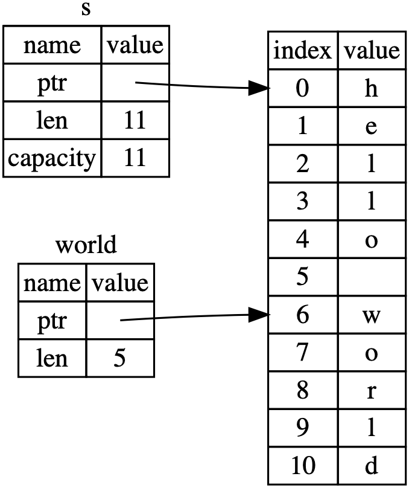

# 切片

问题的提出：
- 需要找出string中的第一个单词
- 实现方式是，返回第一个单词结束的下标

代码实现：
```rust
fn first_word(s: &String) -> usize {
    let bytes = s.as_bytes();

    for (i, &item) in bytes.iter().enumerate() {
        if item == b' ' {
            return i;
        }
    } s.len()
}
```

存在的问题：
1. 该下标值与字符串本身没有强关联关系
2. 如果字符串已失效，并不会直接导致下标值失效
3. 如果字符串失效后继续使用该下标值，就会带来程序错误
4. 如果需要查找第二个单词，则需要得到两个下标值：起始位置和结束为止
5. 随着需求的增加，需要计算和返回的下标值越来越多，且这些下标值与字符串本身是否失效没有直接的联系

例如：
```rust
fn main() {
    let mut s = String::from("hello world");
    let word = first_word(&s);
    
    // s 已失效，但 word 没有失效
    s.clear();
}
```

### String Slice

说明：
1. slice 是对 String 的一部分内容或全部内容的引用
2. 该引用是非 mut 的
3. 该引用的本质内容是 String 的起始位置和结束位置

用法：
1. 对应数据类型是 &str
2. 通过 &String[st..ed] 获得 slice
3. st 默认为 0
4. ed 默认为 String.len()
5. slice 的长度是 ed - st
6. 若 &String[st..=ed] ，则长度为 ed - st + 1
7. 即 [st..ed] 是从 st 开始，到 ed 结束但不包括 ed
8. 而 [st..=ed] 是从 st 开始，到 ed 结束且包括 ed
9. [0..5] 等价于 [..5]
10. [5..] 等价于 [5..String.len()]
11. [..] 等价于 [0..String.len()]

举例：
```rust
let s = String::from("hello world");

let hello = &s[0..5];
let world = &s[6..];
```

则 slice 示意图如下：


现在可以很简单的重写查找单词的例子：
```rust
fn first_word(s: &String) -> &str {
    let bytes = s.as_bytes();

    for (i, &item) in bytes.iter().enumerate() {
        if item == b' ' {
            return &s[0..i];
        }
    } &s[..]
}
```

然后通过下面的例子，来看 slice 与 String 的关联：
```rust
fn main() {
    let mut s = String::from("hello world");
    let word = first_word(&s);

    /*
    编译错误：
    cannot borrow `s` as mutable
    because it is also
    borrowed as immutable
    */
    s.clear();
}
```

剖析：
1. 前面讲过，reference 有一个限制：不允许对同一份数据同时存在 mut 和 非 mut 引用
2. slice 是 &
3. s.clear() 是 &mut
4. 因此编译报错

### 字符串也是Slice

例如：
```rust
let s = "Hello, world!";
```

剖析：
- 字符串"Hello, world!"是硬编码后包含在二进制文件中的
- 而此时 s 的数据类型其实就是 &str
- 所以其实 s 是 slice，指向二进制数据中的某个位置
- 这也是为何字符串是非 mut 的原因
- 所以 &str 也是非 mut 的

### Slice作为函数参数

String 与 &str 的区别：
1. String 存在 Move/Clone/& 等操作
2. &str 则是指硬编码的字符串或者 String 的 Slice
3. 所以，对于函数参数来说，&str 的兼容性更强，也是 Rust 推荐的方式

```rust
// 不推荐
fn first_word(s: &String) -> &str

// 推荐
fn first_word(s: &str) -> &str
```

用下面的例子来详细展示区别：
```rust
fn first_word(s: &str) -> &str {}

fn main() {

    // Sring 类型
    let my_string = String::from("hello world");
    // 将整个 String 转为 Slice 传入
    let word = first_word(&my_string[..]);

    // &str 类型
    let my_string_literal = "hello world";

    // 因此可以直接传递
    let word = first_word(my_string_literal);
    // 这种转换就是没有必要的
    let word = first_word(&my_string_literal[..]);
}
```

### 其它 Slice

说明：
- slice 除了可以用在 String，也可以用在其它类型
- 例如可用于 array，规则都是一样的

举例：
```rust
let a = [1, 2, 3, 4, 5];
// 类型是 &[i32]
let slice = &a[1..3];
```